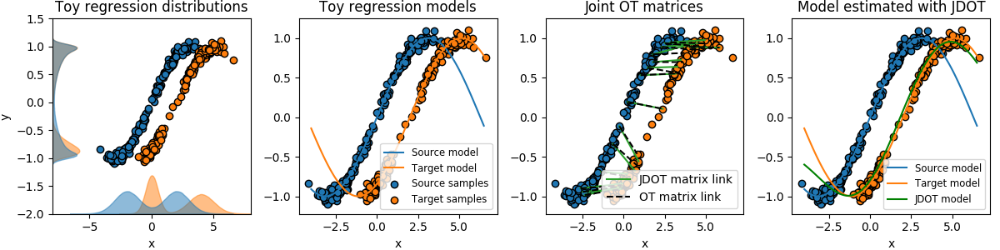
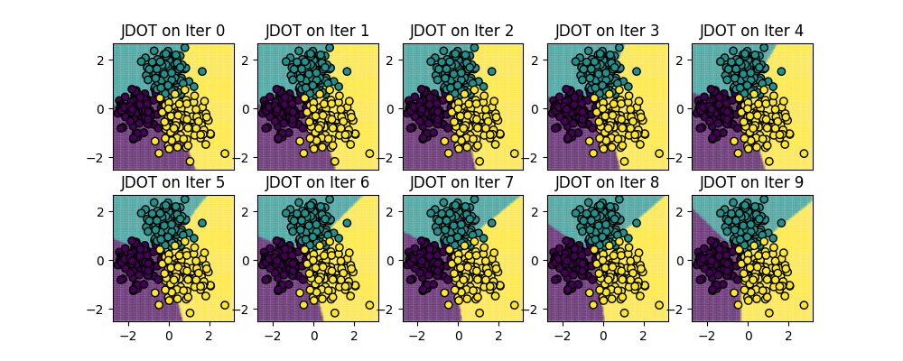

# JDOT
Joint distribution optimal transportation for domain adaptation




This repository contains the code used for the numerical experiments of the foillowing paper:


N. Courty, R. Flamary, A. Habrard, A. Rakotomamonjy, "[Joint Distribution Optimal Transportation for Domain Adaptation](https://arxiv.org/pdf/1705.08848.pdf)", Neural Information Processing Systems (NIPS), 2017.


The code is under MIT Licence but please refer to and cite the above paper if you use it for academic purposes.

Note that this code has not been thouroughly tested and a more clean/robust implementation will be added to the [POT Toolbox](https://github.com/rflamary/POT) that already have numerous optimal transport domain adaptation methods.


##  Dependencies

In order to run, the code requires the following Python modules:

* Numpy/Scipy
* Matplotlib
* [POT](https://github.com/rflamary/POT)

If you want to use the neural network JDOT example you will also need the keras toolbox.


If you have not already installed them you can install the dependencies with PIP using the following command

```
$ pip install numpy scipy matplotlib POT # keras
```

## Modules

* **jdot**: module containing the thre implemented variants of JDOT (Kernel Ridge Regression, Hinge Loss, least  square neural network).
* **classif**:  simple classifier classes used in JDOT.

## Plot examples 

We provide 3 example scripts that reproduce the Figures in the paper.

* **visu_regression.py** Plot Figure 1 in the paper (regression toy example, see below).


* **visu_classification.py** Plot Figure 1 in the supplementary (classification toy example with BCD iterations).




* **visu_regression_nn.py** shows an exmaple of JDOT when learning a keras neural network.


